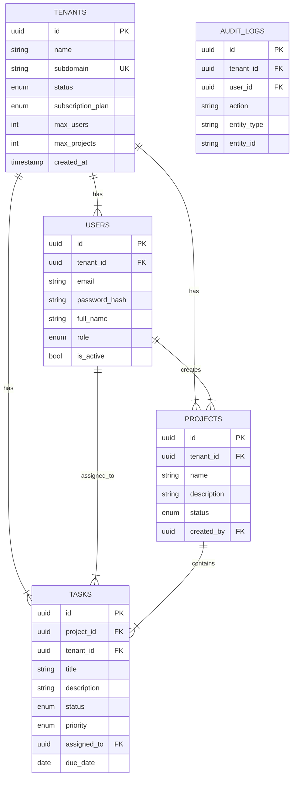

# System Architecture

## 1. High-Level Architecture

The system follows a classic 3-tier web architecture, containerized with Docker.

```mermaid
graph TD
    Client[Client Browser] <-->|HTTPS/JSON| LoadBalancer[Nginx / Docker Proxy]
    LoadBalancer <-->|Port 3000| Frontend[Frontend Container (React)]
    LoadBalancer <-->|Port 5000| Backend[Backend Container (Node.js/Express)]
    Backend <-->|Port 5432| DB[Database Container (PostgreSQL)]
    
    subgraph Docker Network
        Frontend
        Backend
        DB
    end
```

### Components
1.  **Frontend**: React SPA served via a lightweight server (or dev server in this setup). Handles UI logic, Auth state, and calls Backend APIs.
2.  **Backend**: Express.js REST API.
    -   **Auth Middleware**: Decodes JWT, attaches `user` and `tenant` to request.
    -   **RBAC Middleware**: Enforces roles (`super_admin`, `tenant_admin`, `user`).
    -   **Tenant Middleware**: Enforces `WHERE tenant_id = ?` on queries.
3.  **Database**: PostgreSQL. Stores all data in relational tables with Foreign Key constraints.

---

## 2. Database Schema Design (ERD)



---

## 3. API Architecture

### Authentication
- `POST /api/auth/register-tenant`: Register new tenant & admin.
- `POST /api/auth/login`: Authenticate user.
- `GET /api/auth/me`: Get current user details.
- `POST /api/auth/logout`: Logout user.

### Tenant Management
- `GET /api/tenants/:tenantId`: Get tenant details (Admin/SuperAdmin).
- `PUT /api/tenants/:tenantId`: Update tenant details.
- `GET /api/tenants`: List all tenants (SuperAdmin).

### User Management
- `POST /api/tenants/:tenantId/users`: Add user.
- `GET /api/tenants/:tenantId/users`: List users.
- `PUT /api/users/:userId`: Update user.
- `DELETE /api/users/:userId`: Delete user.

### Project Management
- `POST /api/projects`: Create project.
- `GET /api/projects`: List projects.
- `PUT /api/projects/:projectId`: Update project.
- `DELETE /api/projects/:projectId`: Delete project.

### Task Management
- `POST /api/projects/:projectId/tasks`: Create task.
- `GET /api/projects/:projectId/tasks`: List tasks.
- `PATCH /api/tasks/:taskId/status`: Update status.
- `PUT /api/tasks/:taskId`: Update task details.
